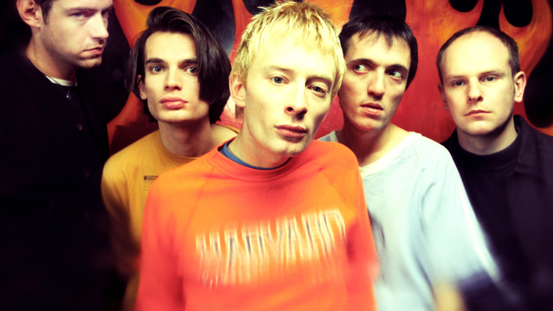
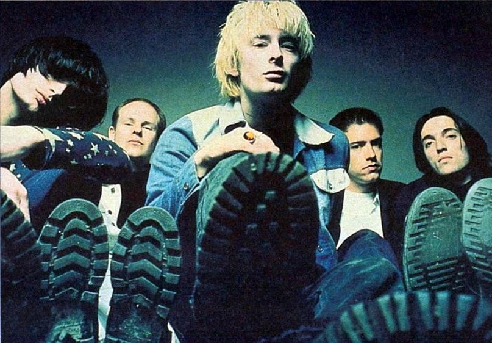

```{r}
library(flexdashboard)
library(spotifyr)
library(tidyverse)
library(plotly)
library(compmus)
library(purrr)
library(htmlwidgets)
library(tidymodels)
library(ggdendro)
library(heatmaply)
```


```{r}
pablohoney <- get_playlist_audio_features("", "5o9KFQJ6uxvaGCihXtxSMv")
thebends <- get_playlist_audio_features("", "7297Y5C4lQ9c8RiIeZSo4c")
okcomputer <- get_playlist_audio_features("", "31M9flclurZ7gSD4tjqjLs")
kidamnesiac <- get_playlist_audio_features("", "0t7DkHCyUMmfl53CRhmKd0")
hailtothethief <- get_playlist_audio_features("", "3daz1tZ64UA3KMbbyPPoXM")
inrainbows <- get_playlist_audio_features("", "2k3CNLrpE5iGzDTuzfHZGT")
thekingoflimbs <- get_playlist_audio_features("", "4S60o4zSaeMfMYwi5Ndxqf")
amoonshapedpool <- get_playlist_audio_features("", "0rllYNwldDnjrOGx03VMnc")
```

Page 7
=====================================     

Sidebar {.sidebar}
-------------------------------------


Column {.tabset}
-------------------------------------

```{r}
get_conf_mat <- function(fit) {
  outcome <- .get_tune_outcome_names(fit)
  fit |> 
    collect_predictions() |> 
    conf_mat(truth = outcome, estimate = .pred_class)
}  

get_pr <- function(fit) {
  fit |> 
    conf_mat_resampled() |> 
    group_by(Prediction) |> mutate(precision = Freq / sum(Freq)) |> 
    group_by(Truth) |> mutate(recall = Freq / sum(Freq)) |> 
    ungroup() |> filter(Prediction == Truth) |> 
    select(class = Prediction, precision, recall)
}  

radiohead <-
  thebends |>
  add_audio_analysis() |>
  mutate(
    segments = map2(segments, key, compmus_c_transpose),
    pitches =
      map(segments,
        compmus_summarise, pitches,
        method = "mean", norm = "manhattan"
      ),
    timbre =
      map(
        segments,
        compmus_summarise, timbre,
        method = "mean"
      )
  ) |>
  mutate(pitches = map(pitches, compmus_normalise, "clr")) |>
  mutate_at(vars(pitches, timbre), map, bind_rows) |>
  unnest(cols = c(pitches, timbre))

halloween_juice <-
  recipe(
    track.name ~
      danceability +
      energy +
      loudness +
      speechiness +
      acousticness +
      instrumentalness +
      liveness +
      valence +
      tempo +
      duration +
      C + `C#|Db` + D + `D#|Eb` +
      E + `F` + `F#|Gb` + G +
      `G#|Ab` + A + `A#|Bb` + B +
      c01 + c02 + c03 + c04 + c05 + c06 +
      c07 + c08 + c09 + c10 + c11 + c12,
    data = radiohead
  ) |>
  step_center(all_predictors()) |>
  step_scale(all_predictors()) |> 
  # step_range(all_predictors()) |> 
  prep(radiohead |> mutate(track.name = str_trunc(track.name, 20))) |>
  juice() |>
  column_to_rownames("track.name")
```

```{r}
halloween_dist <- dist(halloween_juice, method = "euclidean")

halloween_dist |> 
  hclust(method = "single") |> # Try single, average, and complete.
  dendro_data() |>
  ggdendrogram()
```

```{r}
heatmaply(
  halloween_juice,
  hclustfun = hclust,
  hclust_method = "average",  # Change for single, average, or complete linkage.
  dist_method = "euclidean"
)
```

Page 6
=====================================     

Sidebar {.sidebar}
-------------------------------------  

When discussing the complexity of Radiohead songs, one song in particular never fails to be mentioned: Paranoid Android. This song contains significant tempo changes that are pulled off very well, hopefully also making them visible in the tempogram. Most sources online tell that this song has a BPM of around 84. That's how the song starts out at least. After around 3 and a half minutes, the tempo slows down to around 63 BPM, before returning to it's original state for the final section of the song. This is represented in a somewhat vague way in the tempogram, so let me explain. The yellow lines around 330 and 250 BPM are multiples of the original tempo's of the song: 84 and 62 BPM. This is figured out in the second visualization, where the first tempo is correct, but the second tempo is still visualized in double-time. The coda of this piece is presumably a mystery to the computer, as there is no clear yellow line visible in this part.

Column {.tabset}
-------------------------------------

### Chart 1

```{r}
# paranoid |>
#   tempogram(window_size = 8, hop_size = 1, cyclic = TRUE) |>
#   ggplot(aes(x = time, y = bpm, fill = power)) +
#   geom_raster() +
#   scale_fill_viridis_c(guide = "none") +
#   labs(x = "Time (s)", y = "Tempo (BPM)") +
#   theme_classic()
```   

### Chart 2

```{r}
# paranoid <- get_tidy_audio_analysis("6LgJvl0Xdtc73RJ1mmpotq")
# 
# paranoid |>
#   tempogram(window_size = 8, hop_size = 1, cyclic = FALSE) |>
#   ggplot(aes(x = time, y = bpm, fill = power)) +
#   geom_raster() +
#   scale_fill_viridis_c(guide = "none") +
#   labs(x = "Time (s)", y = "Tempo (BPM)") +
#   theme_classic()
```
    
Page 1
=====================================  

Sidebar {.sidebar data-width=275px}
------------------------------------- 

Over the years, Radiohead has been lauded as one of the best bands of all time by both critics and the public. However, like most artists and bands, they too have had to take the time to find their true sound. What started out as a run-off-the-mill alternative rock band quickly grew to something entirely new. 

In this project, I want to show you how the sound of Radiohead has changed from their first album, Pablo Honey, to their most recent release, A Moon Shaped Pool. We'll find out exactly what makes each of their albums special through Spotify's intricate track analysis features. 

```{=html}
<iframe style="border-radius:12px" src="https://open.spotify.com/embed/playlist/2N2R2saYKqgO91e1LK4jvp?utm_source=generator" width="100%" height="352" frameBorder="0" allowfullscreen="" allow="autoplay; clipboard-write; encrypted-media; fullscreen; picture-in-picture" loading="lazy"></iframe>
```

Column
-------------------------------------

### Radiohead (Pablo Honey era)

```{r picture, echo = F, out.width = '100%', out.height= '100%'}

```

### Radiohead (Pablo Honey era 2) 

```{r picture2, echo = F, out.width = '100%', out.height= '100%'}

```

Column
-------------------------------------
### If we smile can we go?

```{r picture3, echo = F, out.width = '100%', out.height= '100%'}

```

### Radiohead (OK Computer era) 

```{r picture4, echo = F, out.width = '100%', out.height= '100%'}

```

Page 2
=====================================  

Sidebar {.sidebar data-width=400px}
-------------------------------------   

Let's first take a look at some basic features of Radiohead's 8 main releases, ranging from 1993 to 2016. Their first album, Pablo Honey, contains all the characteristics one would expect from the grungy alternative rock album it is. All the songs are relatively high in energy and valence and the majority of the tracks fall within the major mode. In comparison to later albums, the tracks are all pretty loud as well. 

This trend then continues on through the next 2 albums, The Bends and OK Computer, although some exceptions to the rule become clear. Both albums contain more songs with a low energy and a low valence. Now, a shift in tone becomes clear. The next album, Kid A Mnesiac (A double album containing two previously individual releases Kid A and Amnesiac), almost entirely consists of songs on the lower end of the valence and energy spectrum. These albums marked the band's departure from more standard alternative rock and saw them adapting a sound that was influenced by electronic music from the time. 

Their next album, Hail to the Thief, sees the band returning to the traditional rock sound with more loud, high-energy songs. A return which is somewhat cut short by the next album, In Rainbows, which beautifully combines the band's electronic influences and alternative rock roots into a melancholic masterpiece. Make no mistake though, there are some outliers in this album, which we'll look into at a later time. The King of Limbs is heavily electronic, containing almost no traditional sounds that the listeners were used to at the time. This, along with many collaborations with electronic artists and DJ's, results in a high-energy album that still conveys Radiohead's gloomy sound. The final album in this corpus, A Moon Shaped Pool, is an almost completely gloomy, low-energy, and very quiet album, with one noteable outlier, "Burn the Witch", which we'll look at later. 

Clearly, a change in the sound of Radiohead is visible. Now let's find out what that change consists of in more detail, as Spotify's track features guide us along the way

Column {.tabset}
-------------------------------------

### Pablo Honey

```{r}
# Create a data frame with the relevant features and track names
pablohoney_df <- data.frame(
  Track = pablohoney$track.name,
  Energy = pablohoney$energy,
  Valence = pablohoney$valence,
  Loudness = pablohoney$loudness
)

# Normalize loudness values to range between 0 and 1 for marker colors
scaled_loudness <- scales::rescale(pablohoney_df$Loudness)

custom_text <- paste(
  "Track: ", pablohoney_df$Track,
  "<br>Energy: ", pablohoney_df$Energy,
  "<br>Valence: ", pablohoney_df$Valence,
  "<br>Loudness: ", round(pablohoney_df$Loudness, 2)
)

# Create scatter plot matrix with marker color representing loudness
scatter_matrix <- plot_ly(
  data = pablohoney_df,
  x = ~Valence,
  y = ~Energy,
  text = custom_text,
  type = "scatter",
  mode = "markers",
  marker = list(
    color = scaled_loudness,
    colorscale = "Viridis", # Choose a color scale
    opacity = 0.7,
    size = 8,
    colorbar = list(title = "Loudness") # Add a color bar with a title
  )
) %>%
  layout(
    title = "Pablo Honey",
    xaxis = list(title = "Valence"),
    yaxis = list(title = "Energy")
  )

# Print the scatter plot matrix
scatter_matrix
```


### The Bends

```{r}
# Create a data frame with the relevant features and track names
thebends_df <- data.frame(
  Track = thebends$track.name,
  Energy = thebends$energy,
  Valence = thebends$valence,
  Loudness = thebends$loudness
)

# Normalize loudness values to range between 0 and 1 for marker colors
scaled_loudness <- scales::rescale(thebends_df$Loudness)

custom_text <- paste(
  "Track: ", thebends_df$Track,
  "<br>Energy: ", thebends_df$Energy,
  "<br>Valence: ", thebends_df$Valence,
  "<br>Loudness: ", round(thebends_df$Loudness, 2)
)

# Create scatter plot matrix with marker color representing loudness
scatter_matrix <- plot_ly(
  data = thebends_df,
  x = ~Valence,
  y = ~Energy,
  text = custom_text,
  type = "scatter",
  mode = "markers",
  marker = list(
    color = scaled_loudness,
    colorscale = "Viridis", # Choose a color scale
    opacity = 0.7,
    size = 8,
    colorbar = list(title = "Loudness") # Add a color bar with a title
  )
) %>%
  layout(
    title = "The Bends",
    xaxis = list(title = "Valence"),
    yaxis = list(title = "Energy")
  )

# Print the scatter plot matrix
scatter_matrix
```   


### Ok Computer
    
```{r}
# Create a data frame with the relevant features and track names
okcomputer_df <- data.frame(
  Track = okcomputer$track.name,
  Energy = okcomputer$energy,
  Valence = okcomputer$valence,
  Loudness = okcomputer$loudness
)

# Normalize loudness values to range between 0 and 1 for marker colors
scaled_loudness <- scales::rescale(okcomputer_df$Loudness)

custom_text <- paste(
  "Track: ", okcomputer_df$Track,
  "<br>Energy: ", okcomputer_df$Energy,
  "<br>Valence: ", okcomputer_df$Valence,
  "<br>Loudness: ", round(okcomputer_df$Loudness, 2)
)

# Create scatter plot matrix with marker color representing loudness
scatter_matrix <- plot_ly(
  data = okcomputer_df,
  x = ~Valence,
  y = ~Energy,
  text = custom_text,
  type = "scatter",
  mode = "markers",
  marker = list(
    color = scaled_loudness,
    colorscale = "Viridis", # Choose a color scale
    opacity = 0.7,
    size = 8,
    colorbar = list(title = "Loudness") # Add a color bar with a title
  )
) %>%
  layout(
    title = "OK Computer",
    xaxis = list(title = "Valence"),
    yaxis = list(title = "Energy")
  )

# Print the scatter plot matrix
scatter_matrix
```

### Kid A Mnesiac 

```{r}
# Create a data frame with the relevant features and track names
kidamnesiac_df <- data.frame(
  Track = kidamnesiac$track.name,
  Energy = kidamnesiac$energy,
  Valence = kidamnesiac$valence,
  Loudness = kidamnesiac$loudness
)

# Normalize loudness values to range between 0 and 1 for marker colors
scaled_loudness <- scales::rescale(kidamnesiac_df$Loudness)

custom_text <- paste(
  "Track: ", kidamnesiac_df$Track,
  "<br>Energy: ", kidamnesiac_df$Energy,
  "<br>Valence: ", kidamnesiac_df$Valence,
  "<br>Loudness: ", round(kidamnesiac_df$Loudness, 2)
)

# Create scatter plot matrix with marker color representing loudness
scatter_matrix <- plot_ly(
  data = kidamnesiac_df,
  x = ~Valence,
  y = ~Energy,
  text = custom_text,
  type = "scatter",
  mode = "markers",
  marker = list(
    color = scaled_loudness,
    colorscale = "Viridis", # Choose a color scale
    opacity = 0.7,
    size = 8,
    colorbar = list(title = "Loudness") # Add a color bar with a title
  )
) %>%
  layout(
    title = "Kid A Mnesiac",
    xaxis = list(title = "Valence"),
    yaxis = list(title = "Energy")
  )

# Print the scatter plot matrix
scatter_matrix
```

### Hail to the Thief 

```{r}
# Create a data frame with the relevant features and track names
hailtothethief_df <- data.frame(
  Track = hailtothethief$track.name,
  Energy = hailtothethief$energy,
  Valence = hailtothethief$valence,
  Loudness = hailtothethief$loudness
)

# Normalize loudness values to range between 0 and 1 for marker colors
scaled_loudness <- scales::rescale(hailtothethief_df$Loudness)

custom_text <- paste(
  "Track: ", hailtothethief_df$Track,
  "<br>Energy: ", hailtothethief_df$Energy,
  "<br>Valence: ", hailtothethief_df$Valence,
  "<br>Loudness: ", round(hailtothethief_df$Loudness, 2)
)

# Create scatter plot matrix with marker color representing loudness
scatter_matrix <- plot_ly(
  data = hailtothethief_df,
  x = ~Valence,
  y = ~Energy,
  text = custom_text,
  type = "scatter",
  mode = "markers",
  marker = list(
    color = scaled_loudness,
    colorscale = "Viridis", # Choose a color scale
    opacity = 0.7,
    size = 8,
    colorbar = list(title = "Loudness") # Add a color bar with a title
  )
) %>%
  layout(
    title = "Hail to the Thief",
    xaxis = list(title = "Valence"),
    yaxis = list(title = "Energy")
  )

# Print the scatter plot matrix
scatter_matrix
```

### In Rainbows

```{r}
# Create a data frame with the relevant features and track names
inrainbows_df <- data.frame(
  Track = inrainbows$track.name,
  Energy = inrainbows$energy,
  Valence = inrainbows$valence,
  Loudness = inrainbows$loudness
)

# Normalize loudness values to range between 0 and 1 for marker colors
scaled_loudness <- scales::rescale(inrainbows_df$Loudness)

custom_text <- paste(
  "Track: ", inrainbows_df$Track,
  "<br>Energy: ", inrainbows_df$Energy,
  "<br>Valence: ", inrainbows_df$Valence,
  "<br>Loudness: ", round(inrainbows_df$Loudness, 2)
)

# Create scatter plot matrix with marker color representing loudness
scatter_matrix <- plot_ly(
  data = inrainbows_df,
  x = ~Valence,
  y = ~Energy,
  text = custom_text,
  type = "scatter",
  mode = "markers",
  marker = list(
    color = scaled_loudness,
    colorscale = "Viridis", # Choose a color scale
    opacity = 0.7,
    size = 8,
    colorbar = list(title = "Loudness") # Add a color bar with a title
  )
) %>%
  layout(
    title = "In Rainbows",
    xaxis = list(title = "Valence"),
    yaxis = list(title = "Energy")
  )

# Print the scatter plot matrix
scatter_matrix

```

### The King of Limbs

```{r}
# Create a data frame with the relevant features and track names
thekingoflimbs_df <- data.frame(
  Track = thekingoflimbs$track.name,
  Energy = thekingoflimbs$energy,
  Valence = thekingoflimbs$valence,
  Loudness = thekingoflimbs$loudness
)

# Normalize loudness values to range between 0 and 1 for marker colors
scaled_loudness <- scales::rescale(thekingoflimbs_df$Loudness)

custom_text <- paste(
  "Track: ", thekingoflimbs_df$Track,
  "<br>Energy: ", thekingoflimbs_df$Energy,
  "<br>Valence: ", thekingoflimbs_df$Valence,
  "<br>Loudness: ", round(thekingoflimbs_df$Loudness, 2)
)

# Create scatter plot matrix with marker color representing loudness
scatter_matrix <- plot_ly(
  data = thekingoflimbs_df,
  x = ~Valence,
  y = ~Energy,
  text = custom_text,
  type = "scatter",
  mode = "markers",
  marker = list(
    color = scaled_loudness,
    colorscale = "Viridis", # Choose a color scale
    opacity = 0.7,
    size = 8,
    colorbar = list(title = "Loudness") # Add a color bar with a title
  )
) %>%
  layout(
    title = "The King of Limbs",
    xaxis = list(title = "Valence"),
    yaxis = list(title = "Energy")
  )

# Print the scatter plot matrix
scatter_matrix
```

### A Moon Shaped Pool

```{r}
# Create a data frame with the relevant features and track names
amoonshapedpool_df <- data.frame(
  Track = amoonshapedpool$track.name,
  Energy = amoonshapedpool$energy,
  Valence = amoonshapedpool$valence,
  Loudness = amoonshapedpool$loudness
)

# Normalize loudness values to range between 0 and 1 for marker colors
scaled_loudness <- scales::rescale(amoonshapedpool_df$Loudness)

custom_text <- paste(
  "Track: ", amoonshapedpool_df$Track,
  "<br>Energy: ", amoonshapedpool_df$Energy,
  "<br>Valence: ", amoonshapedpool_df$Valence,
  "<br>Loudness: ", round(amoonshapedpool_df$Loudness, 2)
)

# Create scatter plot matrix with marker color representing loudness
scatter_matrix <- plot_ly(
  data = amoonshapedpool_df,
  x = ~Valence,
  y = ~Energy,
  text = custom_text,
  type = "scatter",
  mode = "markers",
  marker = list(
    color = scaled_loudness,
    colorscale = "Viridis", # Choose a color scale
    opacity = 0.7,
    size = 8,
    colorbar = list(title = "Loudness") # Add a color bar with a title
  )
) %>%
  layout(
    title = "A Moon Shaped Pool",
    xaxis = list(title = "Valence"),
    yaxis = list(title = "Energy")
  )

# Print the scatter plot matrix
scatter_matrix
```

Page 3
=====================================     

Sidebar {.sidebar}
-------------------------------------  
A good example of the complex structures that Radiohead use in their songs is 'Sail to the Moon', which contains a shift from A major tonality to A minor tonality. The songs starts with an A major chord, from the A major key, and continues with A C major and F major chord, from the A minor key. The complexity of this song is caught very well by the chromagram, as we see the song constantly switching between chords. 

Column {.tabset}
-------------------------------------

### Chart 1

```{r}
sailtothemoon <-
  get_tidy_audio_analysis("7tFsUfrmyBvLdvIByreecz") |>
  select(segments) |>
  unnest(segments) |>
  select(start, duration, pitches)

sailtothemoon |>
  mutate(pitches = map(pitches, compmus_normalise, "euclidean")) |>
  compmus_gather_chroma() |> 
  ggplot(
    aes(
      x = start + duration / 2,
      width = duration,
      y = pitch_class,
      fill = value
    )
  ) +
  geom_tile() +
  labs(x = "Time (s)", y = NULL, fill = "Magnitude") +
  theme_minimal() +
  scale_fill_viridis_c()
```

### Chart 2

```{r}
```   
    
### Chart 3

```{r}
```

Page 4
=====================================     

Sidebar {.sidebar}
-------------------------------------  

Here you'll find the Self-Similarity Matrix and Cepstogram of the track 'Bodysnatchers', from 'In Rainbows'. This track is one of the outliers from the relatively low-energy, ethereal sound I talked about in the introduction and is instead characterized by loud guitars, bass, and hectic drums. This is represented in the Cepstogram, where the first timbre component (loudness) is almost entirely colored yellow or green-ish. The return to blue at around 120 seconds for the third and seventh timbre component is explained by a relatively calm part of the song. The loudness of the song is also characterized by the Self-Similarity Matrix, which is almost entirely dark blue, except for the final few seconds, where it switches over to yellow. The final few seconds of the song are complete silence, which contrasts heavily with the loudness of the previous parts of the song, thus explaining a similar contrast in the Matrix.

Column {.tabset}
-------------------------------------

### Chart 1

```{r}
bodysnatchers <-
  get_tidy_audio_analysis("4pWIwnnqx8k01fuF95UMIg") |> # Change URI.
  compmus_align(bars, segments) |>                     # Change `bars`
  select(bars) |>                                      #   in all three
  unnest(bars) |>                                      #   of these lines.
  mutate(
    pitches =
      map(segments,
        compmus_summarise, pitches,
        method = "rms", norm = "euclidean"              # Change summary & norm.
      )
  ) |>
  mutate(
    timbre =
      map(segments,
        compmus_summarise, timbre,
        method = "rms", norm = "euclidean"              # Change summary & norm.
      )
  )

bodysnatchers |>
  compmus_self_similarity(timbre, "cosine") |> 
  ggplot(
    aes(
      x = xstart + xduration / 2,
      width = xduration,
      y = ystart + yduration / 2,
      height = yduration,
      fill = d
    )
  ) +
  geom_tile() +
  coord_fixed() +
  scale_fill_viridis_c(guide = "none") +
  theme_classic() +
  labs(x = "", y = "")
```

### Chart 2

```{r}
```   
    
### Chart 3

```{r}
```

Page 5
=====================================     

Sidebar {.sidebar}
-------------------------------------  

To see another aspect of the change in Radiohead's sound, let's compare the tempo and duration of their first and final album. 

Column {.tabset}
-------------------------------------

### Chart 1

```{r}
pablo <-
  get_playlist_audio_features(
    "",
    "0rllYNwldDnjrOGx03VMnc"
  ) |>
  add_audio_analysis()
moon <-
  get_playlist_audio_features(
    "",
    "5o9KFQJ6uxvaGCihXtxSMv"
  ) |>
  add_audio_analysis()
pablomoon <-
  pablo |>
  mutate(genre = "Pablo Honey") |>
  bind_rows(moon |> mutate(genre = "A Moon Shaped Pool"))

pablomoon |>
  mutate(
    sections =
      map(
        sections,                                    # sections or segments
        summarise_at,
        vars(tempo, loudness, duration),             # features of interest
        list(section_mean = mean, section_sd = sd)   # aggregation functions
      )
  ) |>
  unnest(sections) |>
  ggplot(
    aes(
      x = tempo,
      y = tempo_section_sd,
      colour = genre,
      alpha = loudness
    )
  ) +
  geom_point(aes(size = duration / 60)) +
  geom_rug() +
  theme_minimal() +
  ylim(0, 5) +
  labs(
    x = "Mean Tempo (bpm)",
    y = "SD Tempo",
    colour = "Album",
    size = "Duration (min)",
    alpha = "Volume (dBFS)"
  )
```

### Chart 2

```{r}
pablomoon |>
  mutate(
    timbre =
      map(
        segments,
        compmus_summarise,
        timbre,
        method = "mean"
      )
  ) |>
  select(genre, timbre) |>
  compmus_gather_timbre() |>
  ggplot(aes(x = basis, y = value, fill = genre)) +
  geom_violin() +
  scale_fill_viridis_d() +
  labs(x = "Spotify Timbre Coefficients", y = "", fill = "Album")
```   
    
### Chart 3

```{r}
```
